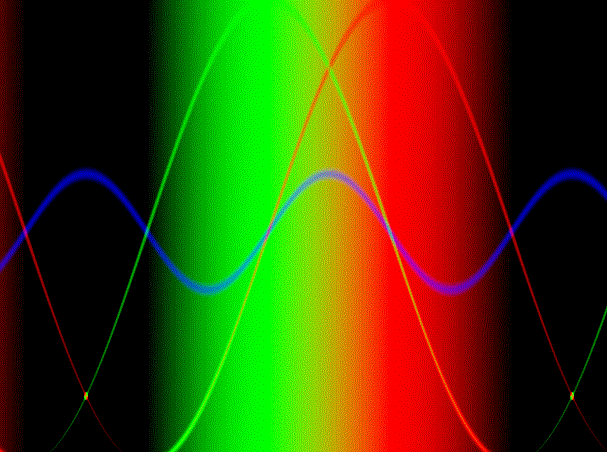

# Shaping Function

Shaping functions are simple and a good start to learning shaders, so this is a series of them 
for practice and good examples to all who want to get involved and see some code that is simple
in its nature and in its math

  |   | 
 | 

Goal was to practice and understand shaders more
